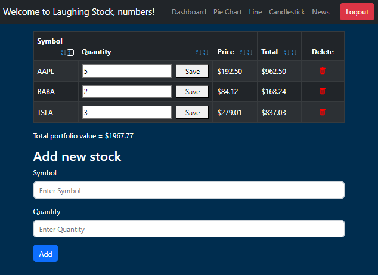
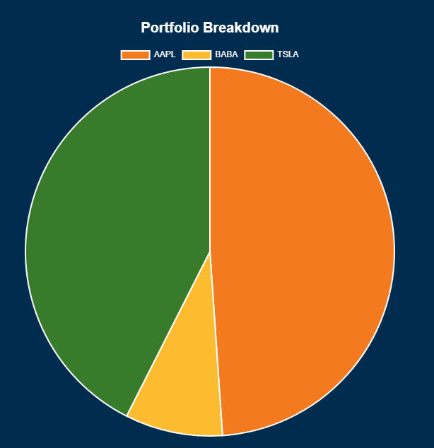

# Laughing Stock

### Level of Achievement
Gemini

### Scope
A web application that displays one's current stock portfolio coupled with analysis tools and a telegram bot.

### Motivation
Checking my stock portfolio using a trading app can be troublesome due to 2FA. This is annoying if I just want to take a quick glance at my portfolio.

### User Stories
- I am a retail investor, and would like an easy way to check my stock portfolio, so that I dont have to go through the hassle of 2FA and deal with long loading times.
- I am a retail investor, and would like an application with analysis tools, so that I can gain an insight on my portfolio's performance and make informed investments.

### Tech Stack
- Frontend: React

- Backend: Express.js

- Database: PostgreSQL

- Hosting Service: fly.io

## Features

### 1. User Login and Authentication


Users can create an account and log in.

To create an account, the user navigates to the /signup page.
After entering the desired username and password, a POST request containing the username and password is sent to the server. The server encrypts the password and stores the encrypted password in the database.

To log in, the user navigates to the /login page. After entering the username and password, a POST request containing the username and password is sent to the server. The server searches the database and tries to find a username that matches the username sent by the user. If no user is found, an error message is shown to the user. Else, the server encrypts the password sent by the user and checks if the encrypted password matches the password belonging to the username in the database. If the match fails, an error message is shown to the user. Else, the login is successful and a token to verify the user's identity is sent to the user. This token is stored in window.localstorage for future use.

### 2. Stock Dashboard


Basic CRUD functionality for users to modify their stock portfolio.

To use the dashboard, a GET request with the token set as the authorization header is sent to the server. The server uses the token to verify the user's identity and returns the stocks belonging to the user. Once the stock data has been retrieved, a GET request containing the stock symbols is sent to the server. The server then makes an API request containing the symbols to the Alpaca Market Data API, where the prices of the requested symbols are retrieved. These prices are then sent back to the user. The frontend processes the data and displays the stocks in a table format.

The dashboard UI has event handlers that send an appropriate API request to the server (GET, POST, PUT, DELETE), whenever the user tries to perform a CRUD operation. The server has routes to receive these API requests and modifies the database accordingly. The server also ensures that an invalid stock will not be added to the database by sending an API request to the Alpaca Market Data API and checking for errors.

The dashboard also allows sorting of stocks based on alphabetical order, quantity, price and total. The most recently used sorting method will be stored in the database and will be automatically applied if the user restarts the application.

### 3. Pie Chart


View composition of portfolio. Chart.js was used to implement the pie chart.

When the user hovers over the pie chart, the total value of the currently hovered stock will be shown.

### 4. Line Chart


View change in portfolio value over time. React ECharts was used to implement the line chart.

Every weekday, a cron script will automatically save the current stocks in the database to a separate table called paststocks. Data in paststocks that is older than a year will automatically be deleted. When the app loads, a GET request will be sent to the server to retrieve the user's historical stock data from paststocks. Afterwards, historical price data will be obtained through an API call to Alpaca Market Data API. The data is then processed and plotted into a line.

When the user hovers over a point on the line chart, a table showing the user's portfolio on a specific date will be shown.

When the user zooms in and out of chart, the difference in portfolio value between the first and last point within the chart window will be shown. The color of the chart will also change according to the difference in portfolio value, green if there is an increase, red if there is a decrease, and gray if there is no change.

### 5. Candlestick Chart


View change in price of a selected stock. Bar data is obtained from Alpaca Market data API, and plotted into a candlestick chart using React ECharts.

When the user hovers over a bar, the open, close, high and low price will be shown along with the date.

### 6. Latest News


A list of links to relevant news articles. News articles are scraped from Google News using Playwright.

When the user changes his/her stock portfolio, the news articles will be updated according to the user's current stock portfolio the next time the user navigates to the news page.

### 7. Telegram Bot


Provides a convenient way for the user to view their stock portfolio on mobile devices (since we don't have a mobile app).

#### Main Commands:
- /start Start the bot.
- /help View all available commands
- /login Login to your Laughing Stock account
- /getnews Get price changes of your stocks over the past week (only available when logged in)
- /logout Log out of your Laughing Stock accout

A new database table called teleusers was created to implement the login functionality. If the login in successful, a telegram account will be linked to the Laughing Stock account by creating an entry in teleusers with the Telegram ID corresponding to the Laughing Stock user ID. When /getnews is called, the server searches for the user's Telegram ID in teleusers. If found, the user is considered logged in and GET request is made to the server to obtain the stocks with the corresponding Laughing Stock user ID. Else, the user is not logged in and the command fails. To log out, the user's Telegram ID is deleted from teleusers.

## System Design


The frontend is broken down into routes using React Router, each with its own React component. The backend is also broken down into routes for handling different API requests from the frontend. The lines between the frontend and the backend represent the flow of API requests.

The database is broken down into tables for storing different types of data. When the backend receives API requests, it queries the database for the required data. The lines between the backend and database represent the connection between the backend API routes and tables which they query their data from.

Our system has some cases where the backend does not query data from the database.
* The news route scrapes data from Google News using Playwright.
* The trades route and bars route makes API requests to the Alpaca Market Data API. 

## Testing
Test the application by visiting https://laughing-stock.fly.dev/

Login to the test account with username 'numbers' and password '12345'. This account is pre-loaded with historical data which allows you to try out the line chart.

Unfortunately, our news feature is broken as we were unable to get Playwright working correctly when the app is deployed.

We have also implemented automated testing.

### Backend Integration Tests
```console
 PASS  tests/api.test.js
  when there are initially some stocks saved
    √ stocks are returned as json (85 ms)                                                                                                                                                                      
    √ all stocks are returned (38 ms)                                                                                                                                                                          
    √ a specific stock is within the returned stocks (23 ms)                                                                                                                                                   
    addition of a new stock                                                                                                                                                                                    
      √ succeeds with valid data (29 ms)                                                                                                                                                                       
      √ fails with status code 400 if data invalid (32 ms)                                                                                                                                                     
      √ fails with status code 401 if token not provided (18 ms)                                                                                                                                               
    deletion of a stock                                                                                                                                                                                        
      √ succeeds with status code 204 if id is valid (35 ms)                                                                                                                                                   
      √ fails with status code 400 if id is invalid (45 ms)                                                                                                                                                    
    update of a stock                                                                                                                                                                                          
      √ succeeds with status code 200 if data and id is valid (34 ms)                                                                                                                                          
      √ fails with status code 400 if data is invalid (38 ms)                                                                                                                                                  
      √ fails with status code 404 if id not found (27 ms)                                                                                                                                                     
  when there is initially one user at db                                                                                                                                                                       
    √ creation succeeds with a fresh username (124 ms)                                                                                                                                                         
    √ creation fails with proper statuscode and message if username already taken (124 ms)                                                                                                                     
                                                                                                                                                                                                               
Test Suites: 1 passed, 1 total                                                                                                                                                                                 
Tests:       13 passed, 13 total                                                                                                                                                                               
Snapshots:   0 total
Time:        2.023 s
```

### Frontend Unit Tests
```console
 PASS  src/components/Signup.test.js
  √ renders the header correctly (27 ms)
  √ renders the form inputs correctly (7 ms)
  √ calls handleUsernameChange when the username input changes (185 ms)
  √ calls handlePasswordChange when the password input changes (234 ms)
  √ calls handleSignup when the form is submitted (498 ms)
  √ renders the notification message correctly after successful signup (525 ms)                                                                                                                                
  √ renders the notification message correctly for empty field error (93 ms)                                                                                                                                   
  √ renders the notification message correctly for taken username error (509 ms)                                                                                                                               
  √ renders the login button correctly (25 ms)                                                                                                                                                                 
  √ navigates to the login page when the Login button is clicked (53 ms)                                                                                                                                       
                                                                                                                                                                                                               
 PASS  src/components/Navbar.test.js                                                                                                                                                                           
  √ renders the welcome message with the username (20 ms)
  √ renders the navigation links (42 ms)                                                                                                                                                                       
  √ calls the handleLogout function when the Logout button is clicked (65 ms)                                                                                                                                  
  √ does not render anything if user is not provided (4 ms)                                                                                                                                                    
  navigation tests                                                                                                                                                                                             
    √ navigates to the main page when dashboard link is clicked (58 ms)                                                                                                                                        
    √ navigates to the piechart page when piechart link is clicked (78 ms)                                                                                                                                     
    √ navigates to the line page when line link is clicked (77 ms)                                                                                                                                             
    √ navigates to the candlestick page when candlestick link is clicked (59 ms)                                                                                                                               
    √ navigates to the news page when news link is clicked (80 ms)                                                                                                                                             
                                                                                                                                                                                                               
 PASS  src/components/Login.test.js
  √ renders the header correctly (15 ms)
  √ renders the form inputs correctly (4 ms)                                                                                                                                                                   
  √ calls handleUsernameChange when the username input changes (186 ms)                                                                                                                                        
  √ calls handlePasswordChange when the password input changes (232 ms)                                                                                                                                        
  √ calls handleLogin when the form is submitted (73 ms)                                                                                                                                                       
  √ renders the notification message correctly (9 ms)                                                                                                                                                          
  √ renders the sign up button correctly (11 ms)                                                                                                                                                               
  √ navigates to the signup page when the sign up button is clicked (72 ms)                                                                                                                                    
                                                                                                                                                                                                               
 PASS  src/components/StockForm.test.js                                                                                                                                                                        
  √ renders the form fields and submit button (14 ms)
  √ calls addStock function on form submission (21 ms)                                                                                                                                                         
  √ updates symbol and quantity values on input change (165 ms)                                                                                                                                                
  √ disables the form inputs and button when loading is true (12 ms)                                                                                                                                           
                                                                                                                                                                                                               
 PASS  src/components/StockTable.test.js                                                                                                                                                                       
  √ renders the table headers (24 ms)
  √ renders the stock rows (12 ms)                                                                                                                                                                             
  √ calls sortStocksAndUpdate function when sort icons are clicked (117 ms)                                                                                                                                    
                                                                                                                                                                                                               
 PASS  src/components/CandlestickForm.test.js                                                                                                                                                                  
  √ renders the form inputs correctly (14 ms)
  √ calls handleNewCandlestickSymbolChange when symbol input changes (110 ms)                                                                                                                                  
  √ calls handleNewCandlestickStartChange when start select changes (93 ms)                                                                                                                                    
  √ calls fetchCandlestickData when form is submitted (73 ms)                                                                                                                                                  
  √ disables the form inputs and button when loading is true (20 ms)                                                                                                                                           
                                                                                                                                                                                                               
 PASS  src/components/Line.test.js                                                                                                                                                                             
  √ should render loading caption when timestamps are null (11 ms)
  √ should render "not enough data" message when timestamps are "not enough data" (1 ms)                                                                                                                       
                                                                                                                                                                                                               
 PASS  src/components/Stock.test.js                                                                                                                                                                            
  √ renders stock symbol (13 ms)
  √ renders stock quantity input (3 ms)                                                                                                                                                                        
  √ calls handleQuantityChange when quantity input is changed (95 ms)                                                                                                                                          
  √ renders stock price (5 ms)                                                                                                                                                                                 
  √ renders stock total (2 ms)                                                                                                                                                                                 
  √ calls deleteStock when delete button is clicked (68 ms)                                                                                                                                                    
  √ calls updateQuantity when save button is clicked (60 ms)                                                                                                                                                   
                                                                                                                                                                                                               
 PASS  src/components/Welcome.test.js                                                                                                                                                                          
  √ renders the header correctly (30 ms)
  √ renders the Login button correctly (9 ms)                                                                                                                                                                  
  √ navigates to the login page when the Login button is clicked (59 ms)                                                                                                                                       
  √ renders features (12 ms)                                                                                                                                                                                   
                                                                                                                                                                                                               
 PASS  src/components/PieChart.test.js                                                                                                                                                                         
  √ renders loading caption when trades have not been loaded (9 ms)
  √ renders pie chart when stocks exist and trades have been loaded (39 ms)                                                                                                                                    
  √ renders "No stocks found" message when stocks array is empty (1 ms)                                                                                                                                        
                                                                                                                                                                                                               
 PASS  src/components/Article.test.js                                                                                                                                                                          
  √ renders article title (11 ms)
  √ renders article date (3 ms)                                                                                                                                                                                
  √ renders article logo (2 ms)                                                                                                                                                                                
  √ renders article source (2 ms)                                                                                                                                                                              
  √ renders article image if available (3 ms)                                                                                                                                                                  
  √ handles click event and opens article link in a new tab (57 ms)                                                                                                                                            
  √ handles mouse enter event and adds hover class to article title (29 ms)                                                                                                                                    
  √ handles mouse leave event and removes hover class from article title (93 ms)                                                                                                                               
  √ handles image load error and hides the image (6 ms)                                                                                                                                                        
  √ when logo is small, handles logo load correctly (4 ms)                                                                                                                                                     
  √ when logo is large, handles logo load correctly (2 ms)                                                                                                                                                     
  √ handles logo error and hides the logo, shows the source (4 ms)                                                                                                                                             
  √ renders play button overlay for YouTube image links (2 ms)                                                                                                                                                 
  √ does not render play button overlay for non-YouTube image links (2 ms)                                                                                                                                     
                                                                                                                                                                                                               
 PASS  src/components/NotFound.test.js                                                                                                                                                                         
  √ renders correctly (22 ms)
  √ navigates to the home page when the go back to home page button is clicked (70 ms)                                                                                                                         
                                                                                                                                                                                                               
 PASS  src/components/News.test.js                                                                                                                                                                             
  √ renders articles when news data is available (17 ms)
  √ renders loading caption when news data is not available (1 ms)                                                                                                                                             
                                                                                                                                                                                                               
 PASS  src/components/PastStockTable.test.js                                                                                                                                                                   
  √ renders the table with past stocks correctly (13 ms)
  √ renders the stock rows (11 ms)                                                                                                                                                                             
                                                                                                                                                                                                               
 PASS  src/components/PastStock.test.js                                                                                                                                                                        
  √ renders the past stock data correctly (10 ms)
  √ formats the price and total with two decimal places (2 ms)                                                                                                                                                 
                                                                                                                                                                                                               
 PASS  src/components/PlaceholderCandlestick.test.js                                                                                                                                                           
  √ renders loading caption when loading is true (9 ms)
  √ renders error message when error is true (1 ms)                                                                                                                                                            
  √ renders default message when loading and error are false (1 ms)                                                                                                                                            
                                                                                                                                                                                                               
Test Suites: 16 passed, 16 total                                                                                                                                                                               
Tests:       80 passed, 80 total                                                                                                                                                                               
Snapshots:   0 total
Time:        9.943 s
```

### End-to-end Tests
```console
  ✓  1 [chromium] › laughing_stock.spec.js:16:3 › when not logged in › main page can be opened (1.9s)
  ✓  2 [chromium] › laughing_stock.spec.js:24:3 › when not logged in › login page can be opened (1.8s)
  ✓  3 [chromium] › laughing_stock.spec.js:48:3 › when not logged in › sign up page can be opened (1.9s)
  ✓  4 [chromium] › laughing_stock.spec.js:86:5 › when not logged in › sign up › succeeds with correct credentials (2.0s)
  ✓  5 [chromium] › laughing_stock.spec.js:100:5 › when not logged in › sign up › fails with wrong credentials (2.0s)
  ✓  6 [chromium] › laughing_stock.spec.js:121:5 › when not logged in › login › succeeds with correct credentials (1.9s)
  ✓  7 [chromium] › laughing_stock.spec.js:135:5 › when not logged in › login › fails with wrong credentials (1.9s)
  ✓  8 [chromium] › laughing_stock.spec.js:172:5 › when logged in › no stocks intially › user can add new stock (2.4s)
  ✓  9 [chromium] › laughing_stock.spec.js:189:5 › when logged in › no stocks intially › invalid stock cannot be added (4.2s)
  ✓  10 [chromium] › laughing_stock.spec.js:219:5 › when logged in › 1 stock initially › user can change stock quantity (4.2s)
  ✓  11 [chromium] › laughing_stock.spec.js:231:5 › when logged in › 1 stock initially › user can delete stock (3.7s)
  ✓  12 [chromium] › laughing_stock.spec.js:267:5 › when logged in › 2 stocks initially › symbol ascending by default (3.6s)
  ✓  13 [chromium] › laughing_stock.spec.js:272:5 › when logged in › 2 stocks initially › symbol descending is working (3.7s)
  ✓  14 [chromium] › laughing_stock.spec.js:280:5 › when logged in › 2 stocks initially › quantity ascending is working (3.6s)
  ✓  15 [chromium] › laughing_stock.spec.js:288:5 › when logged in › 2 stocks initially › quantity descending is working (3.7s)
  ✓  16 [firefox] › laughing_stock.spec.js:16:3 › when not logged in › main page can be opened (1.7s)
  ✓  17 [firefox] › laughing_stock.spec.js:24:3 › when not logged in › login page can be opened (1.4s)
  ✓  18 [firefox] › laughing_stock.spec.js:48:3 › when not logged in › sign up page can be opened (1.5s)
  ✓  19 [firefox] › laughing_stock.spec.js:86:5 › when not logged in › sign up › succeeds with correct credentials (1.6s)
  ✓  20 [firefox] › laughing_stock.spec.js:100:5 › when not logged in › sign up › fails with wrong credentials (1.6s)
  ✓  21 [firefox] › laughing_stock.spec.js:121:5 › when not logged in › login › succeeds with correct credentials (1.6s)
  ✓  22 [firefox] › laughing_stock.spec.js:135:5 › when not logged in › login › fails with wrong credentials (1.6s)
  ✓  23 [firefox] › laughing_stock.spec.js:172:5 › when logged in › no stocks intially › user can add new stock (2.6s)
  ✓  24 [firefox] › laughing_stock.spec.js:189:5 › when logged in › no stocks intially › invalid stock cannot be added (3.2s)
  ✓  25 [firefox] › laughing_stock.spec.js:219:5 › when logged in › 1 stock initially › user can change stock quantity (3.4s)
  ✓  26 [firefox] › laughing_stock.spec.js:231:5 › when logged in › 1 stock initially › user can delete stock (3.4s)
  ✓  27 [firefox] › laughing_stock.spec.js:267:5 › when logged in › 2 stocks initially › symbol ascending by default (3.6s)
  ✓  28 [firefox] › laughing_stock.spec.js:272:5 › when logged in › 2 stocks initially › symbol descending is working (3.6s)
  ✓  29 [firefox] › laughing_stock.spec.js:280:5 › when logged in › 2 stocks initially › quantity ascending is working (3.6s)
  ✓  30 [firefox] › laughing_stock.spec.js:288:5 › when logged in › 2 stocks initially › quantity descending is working (3.6s)
  ✓  31 [webkit] › laughing_stock.spec.js:16:3 › when not logged in › main page can be opened (1.4s)
  ✓  32 [webkit] › laughing_stock.spec.js:24:3 › when not logged in › login page can be opened (1.8s)
  ✓  33 [webkit] › laughing_stock.spec.js:48:3 › when not logged in › sign up page can be opened (1.9s)
  ✓  34 [webkit] › laughing_stock.spec.js:86:5 › when not logged in › sign up › succeeds with correct credentials (2.3s)
  ✓  35 [webkit] › laughing_stock.spec.js:100:5 › when not logged in › sign up › fails with wrong credentials (2.2s)
  ✓  36 [webkit] › laughing_stock.spec.js:121:5 › when not logged in › login › succeeds with correct credentials (1.9s)
  ✓  37 [webkit] › laughing_stock.spec.js:135:5 › when not logged in › login › fails with wrong credentials (2.1s)
  ✓  38 [webkit] › laughing_stock.spec.js:172:5 › when logged in › no stocks intially › user can add new stock (2.4s)
  ✓  39 [webkit] › laughing_stock.spec.js:189:5 › when logged in › no stocks intially › invalid stock cannot be added (3.2s)
  ✓  40 [webkit] › laughing_stock.spec.js:219:5 › when logged in › 1 stock initially › user can change stock quantity (3.3s)
  ✓  41 [webkit] › laughing_stock.spec.js:231:5 › when logged in › 1 stock initially › user can delete stock (3.3s)
  ✓  42 [webkit] › laughing_stock.spec.js:267:5 › when logged in › 2 stocks initially › symbol ascending by default (3.3s)
  ✓  43 [webkit] › laughing_stock.spec.js:272:5 › when logged in › 2 stocks initially › symbol descending is working (3.6s)
  ✓  44 [webkit] › laughing_stock.spec.js:280:5 › when logged in › 2 stocks initially › quantity ascending is working (3.5s)
  ✓  45 [webkit] › laughing_stock.spec.js:288:5 › when logged in › 2 stocks initially › quantity descending is working (3.5s)

  45 passed (2.0m)
```

## Problems Faced and Solutions
- A problem we faced was trying to ensure that the whole application would work in sync. We often encountered issues where a feature would work on its own but as soon as we tried to switch tabs an error would be thrown. To fix this, we implemented loading states to ensure that the components will not be rendered until the required data has been obtained from the server.
- Another problem we faced was the usage of React's useEffect hook, where it would often trigger excessively and make unecessary API calls, resulting in visual glitches on the frontend. To fix this, we added conditional statements to the callback function in useEffect. We also made use of other hooks such as useRef, useCallback and useMemo, to prevent rerendering from affecting variables in the useEffect dependency array.
- We also ran into many bugs when trying to use external libraries due to poor or unclear documentation. To fix this, we had to spend a lot of time doing trial and error, tweaking various parameters and properties in order to obtain our desired outcome.
- Sometimes the data obtained from external APIs are not in the format we want. To fix this, we had to modify the data structures, which proved to be a challenge.
- An issue we have yet to resolve is getting Playwright to work correctly when the app is deployed. From the error messages and our debugging attempts, we believe that Playwright is not installing its browsers in the Docker image. We are still unable to solve this issue despite extensive Googling. At this juncture, it might be more useful to ask for help from a more experienced developer.